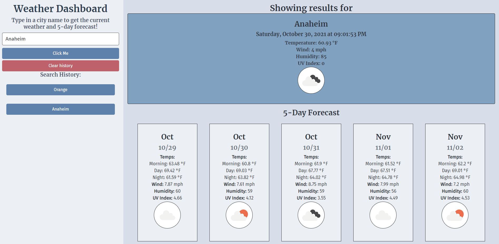

# 06-Weather-Dashboard

## Description

A browser application that shows the current wearther and a 5-day forecast

## Assignment

This is the coding quiz assignment by the UCI Full Stack Developer Boot Camp.

Assignment included building a javascript application that can pull resourses from APIS. This application uses the OpenWeatherAPI so that when a user inputs a city; the application pulls up the weather information for that city. Items searched are saved to page and are stored to the local storage and reinitialized on on re-entry to the page. Pages built using Bootstrap, JQuery and Dayjs.

## Image

## Destination

Url Published at: https://omarace.github.io/06-Weather-Dashboard/
